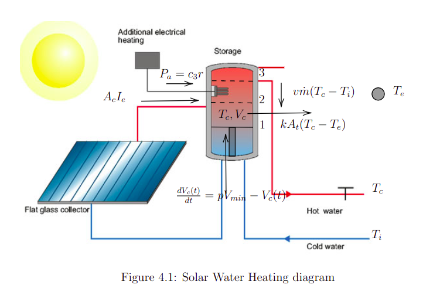

# Readme

1. Run

   ```jsx
   conda env create -f environment.yml
   conda activate ucsp_solar
   pip-compile requirements.in
   pip-sync requirements.txt
   ```

   Do export PYTHONPATH=. in the main directory otherwise it could not find the python package

   ```jsx
   python sthocastic_hybrid_game/src/simulation.py

   ```

   To compute patterns we just need to run the following command.

   ```jsx
   mkdir build && cd build
   cmake .. && make && make test
   ```

2. Case Study: _Solar water heating as stochastic hybrid game_

   2.1 **System Setup**:

   

   The hybrid solar water heating scenario with 12 modes of operations is definedlike this:Gn,m= (C,U,X,F,δ), where the controllerChas a finite set of con-trollable modes, given by resistance stater∈Band piston positionp∈ {1,2,3}.The environmentUhas a finite set of uncontrollable modesv∈B, that meansthe valve state for opening/closing water aperture. We assume that U given δ can switch among modes with equal probability at every period. The state variablesinXare given by{T,E,V}, container temperature, energy used and containervolumen respectively.

   

   2.2 **Data Processing**

   **Stochastic events as historical data**. In practice we notice unpredictable dis-crete events which can perturbate a dynamical system, these stochastic discreteperturbations we call uncontrallable actions and is managed using a stochasticapproach and machine learning to optimize the behaviour. Generate this actionswith a realist criteria for our case study we choose three gaussian distributionswithμ1= 7h,μ2= 12handμ3= 19handσ1= 12,σ2= 15,σ3= 10 respectively.Finally we add a uniform distribution around the day.

   ```jsx
   python stochastic_hybrid_game/src/models/SWH.py
   ```

   

   **Solaris Data and preprocessing.** The data collected is from spain solaris,which consist of a set of environment features such as environment temperature andirradiance that would be useful for the simulation. However, we preprocess the datafor our purpose such us modify the time step from 15 minutes to 1 minute troughinterpolation.

   ```jsx
   python stochastic_hybrid_game/src/data/SOLAR.py
   ```

   

   **Prediction Data**. To integrate a model predictive controller aproach we had to implement a forecaster in real time in order to get a sequence ofenvironment data on future which will be used to control future states an get thecorrect patterns on present.

   

   2.3 **Results**

   ```jsx
   python stochastic_hybrid_game/src/viz/visualizer.py
   ```

   
